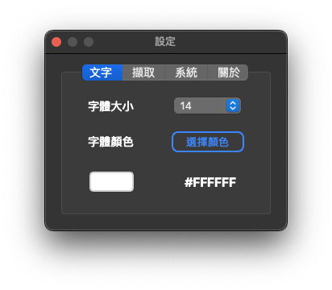
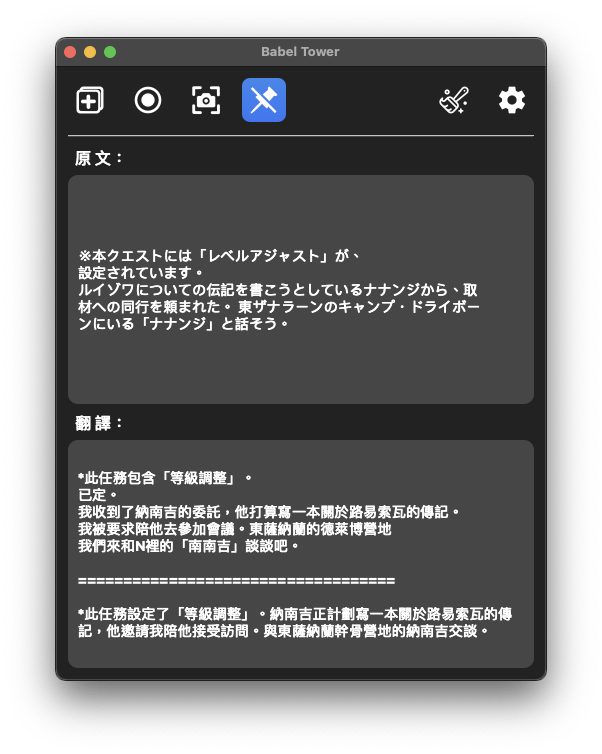
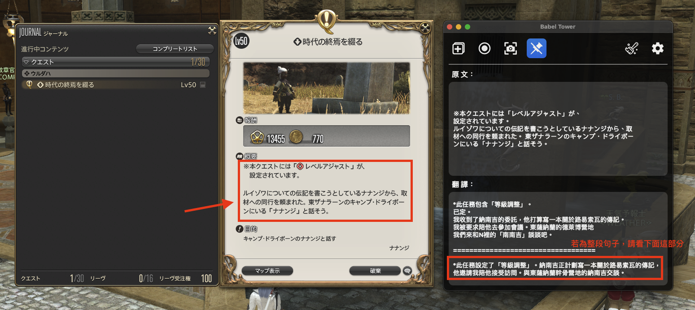

# Babel Tower

Babel Tower 是一款免費、開源的應用程式，此應用程式是專門針對多語系遊戲和影音領域的即時文本翻譯系統，透過此系統盡情享受多語系的遊戲和影音娛樂內容，不再因為看不懂外文而無法享受其中。

- [Download](#download)
- [功能簡介](#功能簡介)
  - [About](#about)
  - [主介面](#主介面)
  - [設定頁面](#設定頁面)
- [如何使用？](#如何使用)
  - [擷取畫面自動翻譯](#擷取畫面自動翻譯字幕文本)
  - [單次截圖辨識及翻譯](#單次截圖辨識及翻譯)
  - [截圖翻譯說明](#截圖翻譯說明)
- [常見 Q&A](#常見-qa)
- [如何申請 Google Cloud Platform API](#如何申請-google-cloud-platform-api)
- [Getting Started](#getting-started)
- [Building App](#building-app)
  - [macOS](#macos)
  - [Windows](#windows)
- [Changing Translated Target Language](#changing-translated-target-langauage)

---

## Download

| Windows                | macOS (ARM64)           |
| ---------------------- | ----------------------- |
| [Portable ZIP][latest] | [DMG Installer][latest] |

[latest]: https://github.com/SMH642800/capture_screen_project/releases/latest

---

## 功能簡介

### About

此軟體是應用 OCR 文字辨識技術以及 Google 翻譯 API 以實現即時翻譯功能，需要連接網路才能使用。由於此系統功能皆為使用線上 API 來實現，因此不會安裝任何第三方軟體在您的電腦上，也不會修改到任何遊戲檔案內容。只要有字幕顯示在畫面上，不論是遊戲還是影音皆可使用此軟體來辨識和翻譯字幕。

※ 注意：由於此系統是透過 [GCP](https://console.cloud.google.com/welcome?hl=zh-tw) 的 API 來實現功能，使用 API 是需要付費的，請謹慎評估之後再決定是否要下載使用！

---

### 主介面


1. 開啟【擷取視窗】：視窗開啟之後，將視窗拖曳到要翻譯的字幕區塊上，並將視窗大小調整到適當大小（建議不要框選到不相關的區塊，以免影響辨識和翻譯效果）
   - ：當擷取視窗已開啟時，會將按鈕常亮。若已開啟的情況下，卻找不到擷取視窗時，可以再按一次按鈕，會將擷取視窗喚醒到所有視窗的最上層

 

2. 開始或暫停【擷取畫面】功能：當擷取視窗開啟，並調整到適當大小後，按下按鈕便會開始擷取畫面並即時翻譯字幕文本


3. 螢幕截圖功能：按下按鈕之後，框選你要辨識翻譯的區塊後，便會將結果顯示在介面上

 

4. 開啟或關閉【釘選視窗】功能：默認為開啟，開啟後主介面會釘選在所有視窗的的最上層。若【擷取視窗】也開啟的狀態下，會跟著主界面一起連動


5. 清除主介面上的文字


6. 開啟【設定】視窗

---

### 設定頁面

- 文字

  
  - 可調整主介面上的辨識和翻譯結果的【文字大小】及【文字顏色】

- 擷取

  
  - 可調整擷取畫面的頻率（即辨識的頻率），預設為【標準 (2 秒)】
  - 擷取頻率建議值：
    - 若字幕以一個一個字顯示，而非一次完整顯示整句，建議將頻率調整成【3 秒】或以上
    - 若為一次顯示完整的句子，則根據字幕顯示的速度自行調整為適當的頻率秒數
  - 【截圖後自動繼續擷取】功能：開啟後，當你在擷取畫面模式時使用截圖功能辨識畫面中某個區塊後，系統會自動倒數5秒，倒數結束之後自動恢復先前的擷取模式。如果關閉此功能，在截圖後，你就必須手動恢復先前的擷取畫面模式。預設為【關閉】。

      

- 系統  
  
  - 在此分頁上，你可以設定 Google 憑證。選擇申請好的憑證檔案後，憑證檔案會被複製到應用程式的資料夾內。這個設定是永久性的，每次啟動應用程式時都會檢查已設定的 Google 憑證是否可用。
  - 若舊的憑證無法使用了，也可以在此頁面更新憑證。- 要如何申請 Google 憑證，可點選這裡[link](#如何申請-google-cloud-platform-api)。

---

## 如何使用?

### 擷取畫面自動翻譯字幕文本

1. 首先，開啟擷取視窗，將視窗拖曳到字幕文本區塊上，並將使窗調整至適當大小
   

2. 接者，按下開始擷取按鈕（由左往右數過來第二個按鈕）

   

3. 按下之後，便會自動擷取您選定的視窗位置的字幕文本內容，然後將其翻譯成中文。當您啟用功能後，系統會持續自動擷取您剛剛選擇的範圍，直到您按下暫停擷取為止。
   

---

### 單次截圖辨識及翻譯

1. 首先，按下螢幕截圖按鈕（由左往右數過來第三個按鈕）

   

2. 接者，框選要截圖辨識的區塊
   

3. 之後便會把剛剛框選的區塊進行辨識和翻譯

   

- 注意：在 Windows 版本中，若是多螢幕狀態，截圖範圍將僅限於應用程式主介面所在的螢幕。

---

### 截圖翻譯說明

- 由於目前系統無法判斷當前截圖辨識的文本為一整段句子還是多個選項的文本，因此系統將會一次呈現兩種結果。
- 情況一：選項文本，請看上半部分
  
- 情況二：整段句子，請看下半部分
  

---

## 常見 Q&A

1. 這程式安全嗎？是如何運作的？

   - 此程式是透過 Google Cloud Vision API 套件進行 OCR 辨識，之後再透過 Google Cloud Translation API 套件將辨識的文字進行翻譯
   - 因此不會在您的電腦上安裝額外軟體，請放心
   - 程式碼皆已公開在 [Github]() 上

2. 在 macOS 上，打開 App 時，系統提示檔案已損毀無法打開？
   - 這是因為 macOS 的安全機制，即使來源正常，也會讓「未信任」應用軟體無法正常執行．這時作業系統給你的回應就是： 「XXX」應用程式已損毀，無法打開．你應該將其丟到「垃圾桶」。
   - 可透過以下連結來解決此問題：[瘋先生 - 如何解決macOS Ventura 13 檔案已損毀無法打開技巧方法](https://mrmad.com.tw/macos-ventura-file-corrupted)
3. 這程式支援辨識哪些語言？
   - 由於此程式是透過 Google Cloud Vision API 套件進行 OCR 辨識，因此只要 Google Cloud Vision 有支援的話，皆可以辨識，世界上大部分主流語言皆有支援
4. 能翻譯成其他語言嗎？

   - 目前系統預設是翻譯成繁體中文，尚未支援讓使用者選擇翻譯成其他語言的功能

5. 程式視窗無法維持在最上層？

   - 請確保你要使用翻譯的應用程式是設定【視窗模式】，而非【全螢幕模式】

6. 為何沒有辨識到完整的字幕文本？

   - 由於此應用程式是使用 Google Cloud Vision API 來識別畫面上的文字。為了避免重複辨識，系統會自動比對前後張畫面的相似度，判斷是否需要進行辨識。這樣做可以避免無用的 API 請求，降低額外的費用支出
   - 如果字幕不是一次完整顯示整句話，而是一個一個字顯示，建議將顯示頻率調整成至少 3 秒以上。這樣可以避免抓取速度太快，造成前後張畫面的相似度過高，讓系統誤判為不需要辨識，進而導致無法正確抓取到完整的句子

7. 如果我不想要使用這個程式了，我該去哪裡刪除掉該程式的設定檔？
   - 在 macOS 上，直接將整個 App 丟到垃圾桶即可
   - 在 Windows 上，可以前往 `C:\Users(使用者)\user\Documents` 資料夾底下，會有一個 `Babel Tower` 資料夾，將該資料夾刪除即可

---

## 如何申請 Google Cloud Platform API

::: warning

- 請注意，由於 cloud vision 和 cloud translation API 每個月皆有一定次數的免費額度限制，超過免費額度上限之後必須支付使用 API 的費用。
- cloud vision 免費額度 ： 每個月前 1000 次請求免費，之後==每 1000 次請求需支付 1.5 美元==（實際收費方案請自行查閱 GCP (Google Cloud Platform) 頁面，此文章為 2023 年時撰寫的）
  :::

---

## Getting Started

To compile BabelTower from source code, follow these steps:

1. Install `Python`, the following Python packages are required:

   - macOS:

   ```bash
   pyside6
   pillow
   opencv-python
   toml
   google-cloud-vision
   google-cloud-translate
   ```

   - Windwos:

   ```bash
   pyside6
   pillow
   opencv-python
   pygetwindow
   mss
   toml
   google-cloud-vision
   google-cloud-translate
   ```

2. Clone the BabelTower repository
3. Run `cd BabelTower` to enter the project folder
4. Run `python main.py` or `python3 main.py` to start the App:
   - on `macOS`, you need to run `cd app/macos` first
   - on `windows`, you need to run `cd app/windows` first

---

## Building App

If you want to compile the source code into an executable file, follow these steps:

1. Install `Python`, packages same as [Getting Started](#getting-started) in step 1
2. Install `pyinstaller` package (This is a package used to compile `Python files` into `Executable file`)
3. Clone the BabelTower repository
4. Run `cd BabelTower` to enter the project folder
5. Run `pyinstaller ${.spec file}` to build the App

### macOS

```bash
pyinstaller myAPP_macOS.spec
```

### windows

```bash
pyinstaller myAPP_windows.spec
```

---

## Changing Translated Target Langauage

If you want to change the translated target language to the one you prefer, go to `main.py` and change below code:

```python
target_language = "zh-TW"  # Replace this with your target language code (e.g., English -> en, Japanese -> ja).
```

You can go to [here](https://cloud.google.com/translate/docs/languages) to check supported languages.
