# Babel Tower

🌐 Available Languages: [English](README.md) | [繁體中文](README_zhTW.md)

- [About](#about)
- [Download](#download)
- [Features](#-features-overview)
  - [Main Interface](#️-main-interface)
  - [Settings Page](#️-settings-page)
- [How to Use](#-how-to-use)
  - [Auto-Translate Subtitles via Screen Capture](#-auto-translate-subtitles-via-screen-capture)
  - [One-Time Screenshot Recognition and Translation](#️-one-time-screenshot-recognition-and-translation)
  - [Screenshot Translation Explanation](#-screenshot-translation-explanation)
- [FAQ](#-frequently-asked-questions-faq)
- [Getting Started](#getting-started)
- [Building the App](#building-the-app)
  - [macOS](#macos)
  - [Windows](#windows)
- [Changing Translated Target Langauage](#changing-translated-target-langauage)

---

## About

**Babel Tower** is a free and open-source application designed specifically for real-time text translation in multilingual games and media content. With this system, you can fully enjoy games and entertainment across different languages without being hindered by language barriers.

This software utilizes **OCR (Optical Character Recognition)** technology combined with the **Google Translate API** to achieve real-time translation functionality, and requires an internet connection to operate. Since all features are implemented using online APIs, the software does **not install any third-party programs** on your computer, nor does it **modify any game files**. As long as subtitles appear on the screen—whether in games or videos—this software can recognize and translate them.

⚠️ **※ Note: This system uses the [GCP](https://console.cloud.google.com/welcome?hl=en) API, which may incur fees. Please evaluate carefully before use.**

---

## Download

| Windows                | macOS (ARM64)           |
|------------------------|-------------------------|
| [Portable ZIP][latest] | [DMG Installer][latest] |

**※ If your antivirus software blocks Babel Tower after downloading, please remember to add Babel Tower to your antivirus whitelist.**

[latest]: https://github.com/SMH642800/BabelTower/releases/latest

---

## ✨ Features Overview

### 🖥️ Main Interface

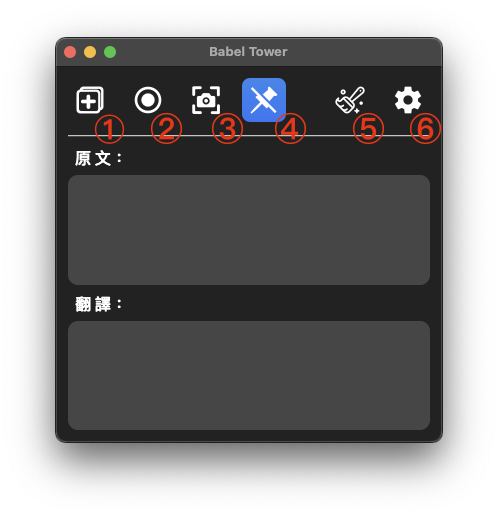


1. **Open the Capture Window:**  
   After opening, drag the window over the subtitle area you want to translate and resize it appropriately. (It is recommended not to select irrelevant areas to avoid affecting recognition and translation.)

   -   
     When the Capture Window is open, this button stays highlighted.  
     If the window gets lost, press the button again to bring the Capture Window to the top of all windows.

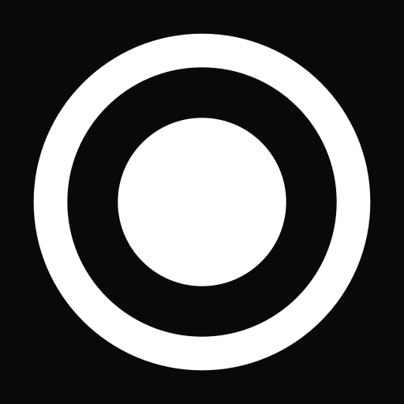 

2. **Start or pause screen capturing:**  
   After adjusting the Capture Window, press this button to start capturing the screen and translating subtitles in real-time.


3. **Screenshot function:**  
   Press the button, select the area you want to recognize and translate, and the result will be displayed on the main interface.


 

4. **Enable or disable window pinning:**  
   By default, this feature is enabled. When activated, the main interface stays pinned on top of all windows.  
   If the Capture Window is also open, they will be synchronized.


5. **Clear text:**  
   Clears the text displayed on the main interface.


6. **Open the Settings window.**

---

### ⚙️ Settings Page

- **Text**

  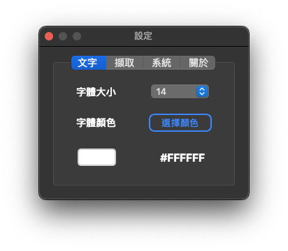

  - Adjust the **font size** and **font color** for the recognition and translation results displayed on the main interface.

- **Capture**

  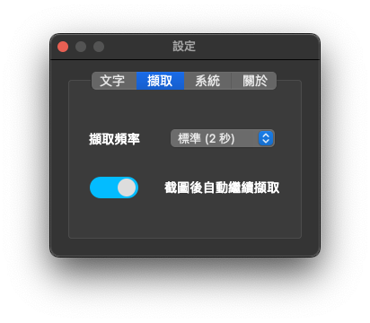

  - Adjust the screen capture frequency (i.e., the OCR recognition interval). The default is **Standard (2 seconds)**.
  - **Recommended capture intervals:**
    - If subtitles appear **character by character**, it is recommended to set the interval to **3 seconds or longer**.
    - If full sentences appear at once, adjust the interval based on the subtitle display speed.
  - **Auto Resume After Screenshot:**  
    When enabled, after you use the screenshot function during screen capture mode, the system will automatically countdown 5 seconds and resume the previous capture mode.  
    If disabled, you must manually restart the capture mode after taking a screenshot.  
    This option is **disabled by default**.

    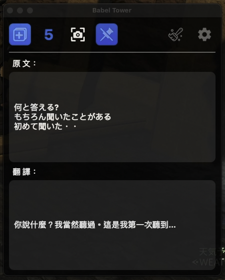

- **System**

  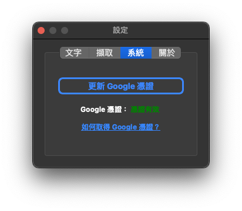

  - In this tab, you can configure your **Google credential file**.  
    After selecting the credential file you've applied for, it will be copied to the application's directory.  
    This configuration is **persistent** and will be checked every time the application starts.
  - If the existing credential becomes invalid, you can update it here.

---

## 📘 How to Use

### 🎥 Auto-Translate Subtitles via Screen Capture

1. First, open the capture window and drag it over the subtitle area. Resize it appropriately for best results.
   

2. Then, click the **Start Capture** button (the second button from the left).
   
   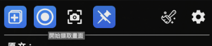

3. Once started, the system will automatically capture the selected region and translate any detected subtitle text into Chinese. It will continue to do so until you click the **Pause Capture** button.
   

---

### 🖼️ One-Time Screenshot Recognition and Translation

1. Click the **Screenshot** button (the third button from the left).
   
   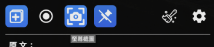

2. Select the region you want to recognize and translate.
   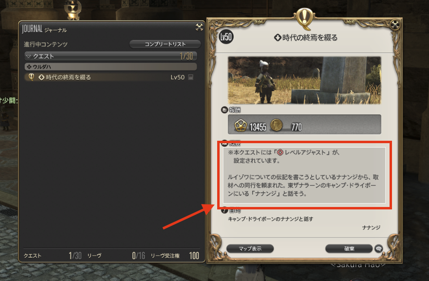

3. The selected region will be recognized and translated immediately.
   

> ⚠️ **Note:** In the Windows version, if you're using multiple monitors, the screenshot area is limited to the monitor where the application main interface is located.

---

### 📝 Screenshot Translation Explanation

- Since the system cannot determine whether the screenshot contains a **full sentence** or **multiple options**, it will display both types of translation results.

- **Case 1: Option-style text** — see the top portion of the result.
  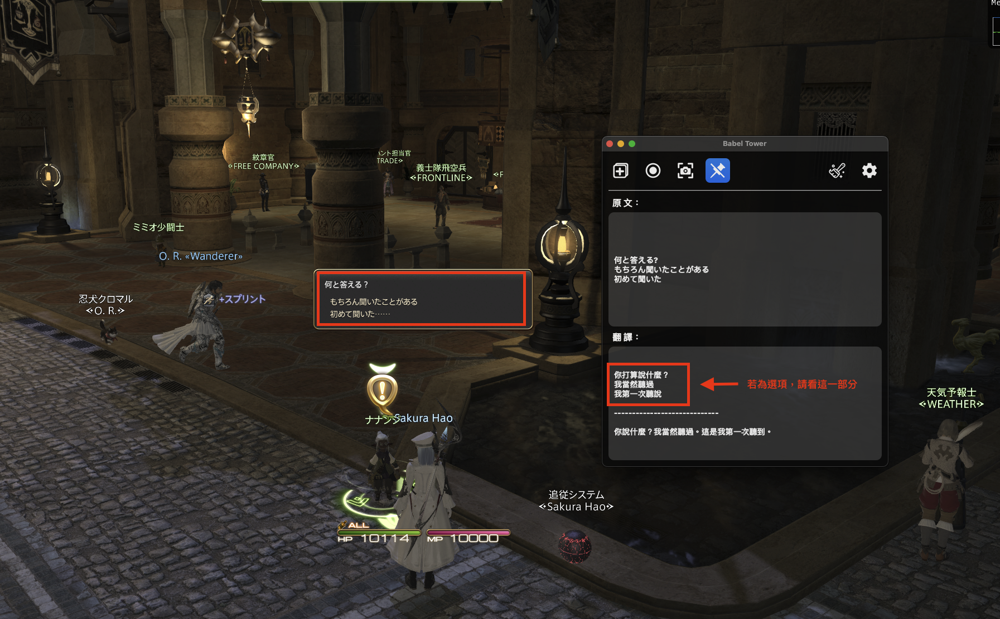

- **Case 2: Full sentence** — see the bottom portion of the result.
  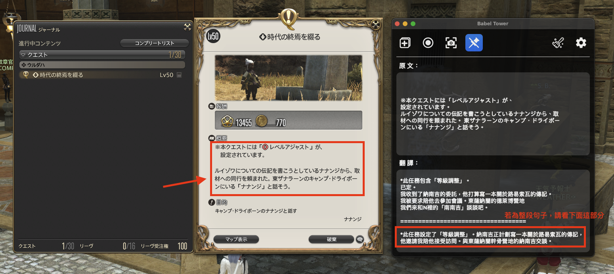

---

## ❓ Frequently Asked Questions (FAQ)

1. **Is this application safe? How does it work?**

   - This application uses the **Google Cloud Vision API** for OCR and the **Google Cloud Translation API** for translation.
   - It does not install any additional software on your system — you can use it with confidence.
   - All source code is publicly available on [GitHub]().

2. **On macOS, why do I get an error saying the app is "damaged and can’t be opened"?**

   - This is due to macOS security mechanisms. Even if the app is safe, macOS may block execution of unverified software and show the message:  
     **“XXX is damaged and can’t be opened. You should move it to the Trash.”**
   - To resolve this issue, follow the guide here:  
     [Mr. MAD - How to Fix "File Damaged" Error on macOS Ventura 13](https://mrmad.com.tw/macos-ventura-file-corrupted)

3. **Which languages does this app support for recognition?**

   - As long as the language is supported by **Google Cloud Vision API**, it can be recognized.  
     Most major languages in the world are supported.

4. **Can the app translate into languages other than Traditional Chinese?**

   - Currently, the translation output is fixed to **Traditional Chinese**.  
     Custom translation target language is **not yet supported**.

5. **Why doesn't the app window stay on top?**

   - Make sure the application you're translating is running in **windowed mode**, not **full-screen mode**.

6. **Why isn't the entire subtitle being recognized?**

   - The app uses **Google Cloud Vision API** to detect text on screen.  
     To reduce unnecessary API calls, it compares the similarity between the current and previous screenshots to avoid redundant recognition.
   - If your subtitles appear **one character at a time** instead of full sentences, it's recommended to set the capture interval to **3 seconds or more**.  
     This reduces the chance of the system thinking the screen hasn't changed and skipping OCR.

7. **How do I delete the app's configuration files if I no longer want to use it?**

   - **macOS:** Simply drag the entire app to the Trash.
   - **Windows:** Go to `C:\Users\<YourUsername>\Documents` and delete the `Babel Tower` folder.

---

## Getting Started

To compile BabelTower from source code, follow these steps:

1. Install `Python`, the following Python packages are required:

   ```bash
   # on macOS platform
   pyside6
   pillow
   opencv-python
   toml
   google-cloud-vision
   google-cloud-translate
   ```

   ```bash
   # on Windows platform
   pyside6
   pillow
   opencv-python
   pygetwindow
   mss
   toml
   google-cloud-vision
   google-cloud-translate
   ```

2. Clone the BabelTower repository
3. Run `cd BabelTower` to enter the project folder
4. Run `python main.py` or `python3 main.py` to start the App:

   ```bash
   # on macOS platform
   # cd into macos folder at first
   cd app/macos

   # execute python file
   python main.py
   ```

   ```bash
   # on Windows platform
   # cd into windows folder at first
   cd app/windows

   # execute python file
   python main.py
   ```

---

## Building App

If you want to compile the source code into an executable file, follow these steps:

1. Install `Python`, packages same as [Getting Started](#getting-started) in step 1
2. Install `pyinstaller` package (This is a package used to compile `Python files` into `Executable file`)
3. Clone the BabelTower repository
4. Run `cd BabelTower` to enter the project folder
5. Run `pyinstaller ${.spec file}` to build the App

### macOS

```bash
pyinstaller myAPP_macOS.spec
```

### windows

```bash
pyinstaller myAPP_windows.spec
```

---

## Changing Translated Target Langauage

If you want to change the translated target language to the one you prefer, go to `main.py` and change below code:

```python
target_language = "zh-TW"  # Replace this with your target language code (e.g., English -> en, Japanese -> ja).
```

You can go [here](https://cloud.google.com/translate/docs/languages) to check out supported languages.
